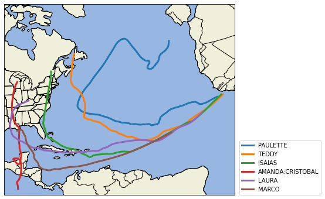

# Project Title

## Motivation

This is a short example project.

Import libraries.


```python
import cartopy.crs as ccrs
import matplotlib.pyplot as plt
import cartopy.feature as cfeature
import cartopy
import seaborn as sns
import numpy as np
import pandas as pd
```

### Data

This is how I got the data


```python
d2020 = pd.read_csv('2020storms.csv')
```


```python
d2020.head(2)
```


<div>
<style scoped>
    .dataframe tbody tr th:only-of-type {
        vertical-align: middle;
    }

    .dataframe tbody tr th {
        vertical-align: top;
    }

    .dataframe thead th {
        text-align: right;
    }
</style>
<table border="1" class="dataframe">
  <thead>
    <tr style="text-align: right;">
      <th></th>
      <th>ID</th>
      <th>year</th>
      <th>num_in_year</th>
      <th>name</th>
      <th>ISO_time</th>
      <th>lat</th>
      <th>lon</th>
      <th>track_type</th>
      <th>dist2land</th>
      <th>landfall</th>
      <th>wind</th>
      <th>pressure</th>
      <th>cat</th>
    </tr>
  </thead>
  <tbody>
    <tr>
      <th>0</th>
      <td>2020137N24278</td>
      <td>2020</td>
      <td>25</td>
      <td>ARTHUR</td>
      <td>2020-05-15 12:00:00</td>
      <td>23.5000</td>
      <td>-81.6000</td>
      <td>PROVISIONAL</td>
      <td>44</td>
      <td>44.0</td>
      <td>25.0</td>
      <td>1011.0</td>
      <td>Misc</td>
    </tr>
    <tr>
      <th>1</th>
      <td>2020137N24278</td>
      <td>2020</td>
      <td>25</td>
      <td>ARTHUR</td>
      <td>2020-05-15 15:00:00</td>
      <td>23.8552</td>
      <td>-81.1955</td>
      <td>PROVISIONAL</td>
      <td>89</td>
      <td>89.0</td>
      <td>25.0</td>
      <td>1011.0</td>
      <td>Misc</td>
    </tr>
  </tbody>
</table>
</div>


```python
d2020['ID'].nunique()
```


    25


```python
d2020['name'].nunique()
```


    25


```python
num_storms = 5

longest = list(d2020['name'].value_counts().index[0:(num_storms+1)])
longest_storms = d2020[d2020['name'].isin(longest)]
df = longest_storms.sort_values(by=['name','ISO_time'])

lat = df['lat']
lon = df['lon']
names = df['name']
```


```python
extent = [lon.min()-2, lon.max()+2, lat.min()-2, lat.max()+2]
#central_lon = np.mean(extent[:2])
#central_lat = np.mean(extent[2:])
central_lon = -96.8
central_lat = 32.8

plt.figure(figsize=(12, 6))
ax = plt.axes(projection=ccrs.AlbersEqualArea(central_lon, central_lat))
ax.set_extent(extent)

ax.add_feature(cartopy.feature.OCEAN)
ax.add_feature(cartopy.feature.STATES)
ax.add_feature(cartopy.feature.COASTLINE)
ax.add_feature(cartopy.feature.BORDERS)
ax.add_feature(cartopy.feature.LAND, edgecolor='black')

for storm in longest:
    plt.plot(lon[df['name'] == storm], lat[df['name'] == storm], 
             linestyle='-',label=storm, linewidth=3,transform=ccrs.PlateCarree())

plt.legend(loc=(1.02,0))
```


    <matplotlib.legend.Legend at 0x7fbddcfa1ee0>


    /opt/anaconda3/lib/python3.8/site-packages/cartopy/io/__init__.py:260: DownloadWarning: Downloading: https://naciscdn.org/naturalearth/110m/physical/ne_110m_ocean.zip
      warnings.warn('Downloading: {}'.format(url), DownloadWarning)
    /opt/anaconda3/lib/python3.8/site-packages/cartopy/io/__init__.py:260: DownloadWarning: Downloading: https://naciscdn.org/naturalearth/110m/physical/ne_110m_land.zip
      warnings.warn('Downloading: {}'.format(url), DownloadWarning)
    /opt/anaconda3/lib/python3.8/site-packages/cartopy/io/__init__.py:260: DownloadWarning: Downloading: https://naciscdn.org/naturalearth/110m/cultural/ne_110m_admin_1_states_provinces_lakes.zip
      warnings.warn('Downloading: {}'.format(url), DownloadWarning)
    /opt/anaconda3/lib/python3.8/site-packages/cartopy/io/__init__.py:260: DownloadWarning: Downloading: https://naciscdn.org/naturalearth/110m/cultural/ne_110m_admin_0_boundary_lines_land.zip
      warnings.warn('Downloading: {}'.format(url), DownloadWarning)





```python

```
